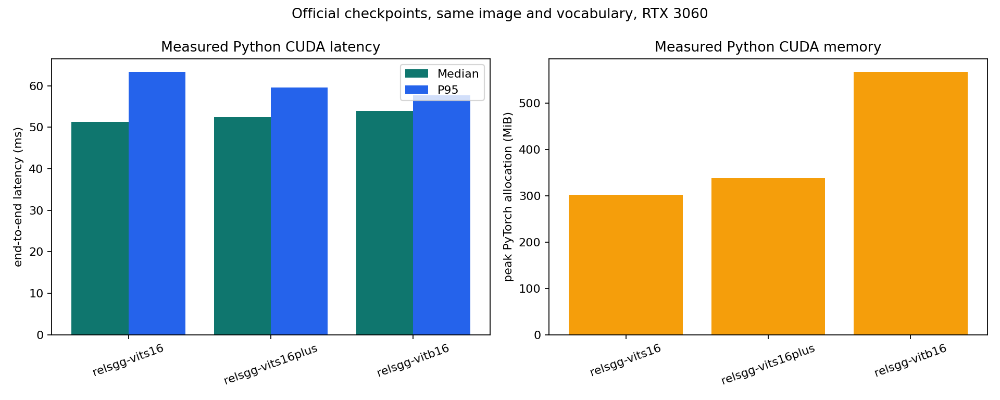
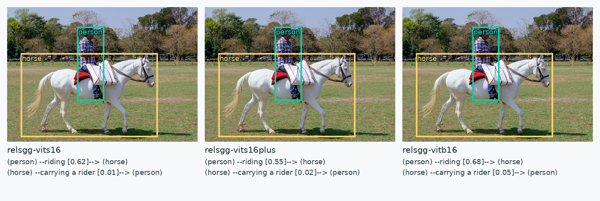

# PyTorch CUDA reference

The official Python path was measured with the three downloaded checkpoints,
the repository's `assets/reel/images/horse.jpg`, the same two boxes, and the
same four-predicate vocabulary. Each model used two warmups and ten timed
calls; `torch.cuda.synchronize()` fenced every call. The numbers include image
preprocessing, DINOv3 feature extraction, the relation head, vocabulary
scoring, calibration, and triplet decoding.

| Pipeline | Device | Mean | Median | P95 | Peak allocated | Output sample |
|---|---|---:|---:|---:|---:|---|
| `relsgg-vits16` | RTX 3060 CUDA | 54.374 ms | 51.295 ms | 63.390 ms | 302 MiB | `person --riding--> horse` |
| `relsgg-vits16plus` | RTX 3060 CUDA | 52.869 ms | 52.488 ms | 59.625 ms | 338 MiB | `person --riding--> horse` |
| `relsgg-vitb16` | RTX 3060 CUDA | 54.299 ms | 53.903 ms | 57.713 ms | 568 MiB | `person --riding--> horse` |

The complete machine-readable rows, including checkpoint SHA256, versions,
boxes, vocabulary, min/max latency, and all returned triplets, are in
[`pytorch_cuda_results.jsonl`](pytorch_cuda_results.jsonl). Re-run them with:





```sh
python3 cpp_ggml/scripts/benchmark_pytorch.py \
  --device cuda --warmup 2 --repeats 10 \
  --output cpp_ggml/benchmarks/pytorch_cuda_results.jsonl
```

The current C++ `relation_pair_linear_v1` benchmark receives precomputed object
features and boxes. Its sub-millisecond numbers therefore are not a valid
end-to-end comparison with this full Python result. A full C++ DINOv3 and
dynamic-head exporter is required before claiming Python parity or a speedup.

The [RA-4M sample comparison](ra4m_python_samples.png) separately shows
full-vocabulary predictions from the same three checkpoints beside official
validation annotations from COCO, Objects365 and Open Images. Its
[structured output](ra4m_python_samples.json) records the checkpoint hashes
and image-shard hash; three examples do not establish corpus-level accuracy.
