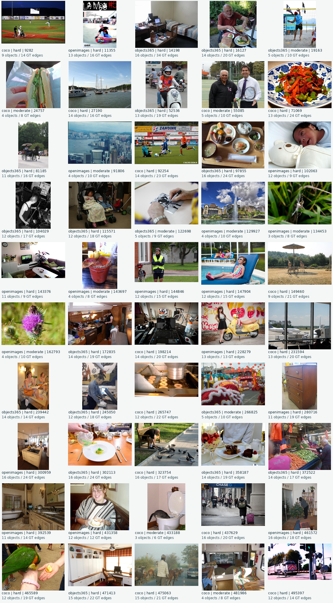
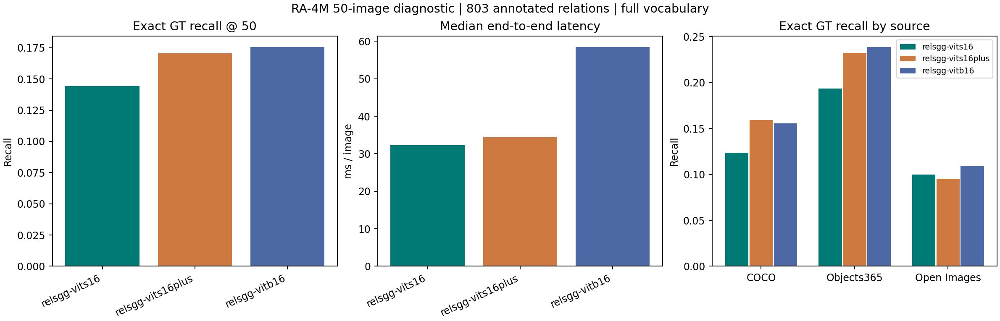
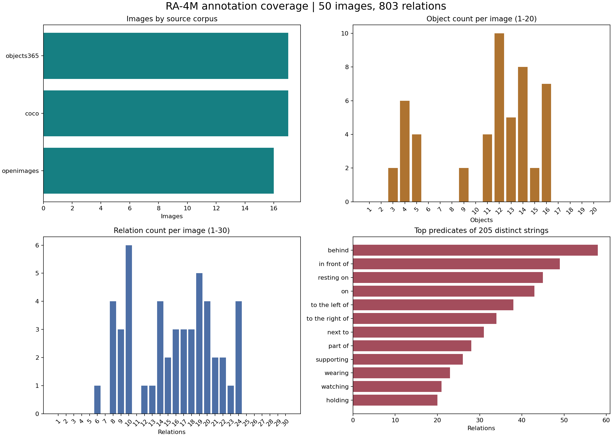

# RA-4M 50-image evaluation

The retained suite is `../test_data/ra4m_50/manifest.json` plus 50 original
image files in `images/`. It was selected deterministically from all five
validation parquet shards of revision
`64829d57318dc8b32ac3e029ac84fbb9834a7700`. Original object and relation
records, including available masks, were copied into the manifest. Image hashes,
dimensions, exact image count, and relation endpoints are checked by
`scripts/compact_ra4m.py --verify-only`. The 49,350,823,236-byte download was
removed after verification; the selected images total 3,562,723 bytes.

| Coverage | Value |
|---|---:|
| Images | 50: COCO 17, Objects365 17, Open Images 16 |
| Selection difficulty | 38 hard, 12 moderate |
| Annotated relations | 803 |
| Distinct object categories | 200 |
| Distinct predicate strings | 205 |
| Scene groups | people 32, interior 13, transport 10, food 8, animals 7, outdoor 6, work 6, sports 4 |

The hard label is an explicit selection heuristic: at least six objects,
eleven relations, two small objects, or two overlapping box pairs. Scene groups
overlap. The contact sheet permits visual review of every retained image:



The official Python checkpoints were evaluated on **all 50** images with
ground-truth boxes, no masks, each model's full released vocabulary, `topk=50`,
and CUDA synchronization around every inference call on an RTX 3060. Each
image was decoded and inferred three times after one model warmup; the
per-image median includes image decoding, box conversion and triplet decoding,
but excludes checkpoint and vocabulary loading. The
strict diagnostic metric counts an exact match of `(subject index, object
index, predicate string)` among the top 50 predictions. It does not use the
upstream synonym matcher, predicate-overlap buckets, or federated negatives.

| PyTorch-CUDA model | Exact GT matches / 803 | R@20 | R@50 | Macro R@50 | Pair R@50 | Median / P95 ms | Peak allocated MiB |
|---|---:|---:|---:|---:|---:|---:|---:|
| relsgg-vits16 | 116 | 9.71% | 14.45% | 11.37% | 82.09% | 32.26 / 36.20 | 294.4 |
| relsgg-vits16plus | 137 | 11.58% | 17.06% | 10.96% | 82.25% | 34.43 / 38.51 | 321.6 |
| relsgg-vitb16 | 141 | 12.08% | 17.56% | 13.00% | 83.31% | 58.47 / 63.68 | 555.6 |

Macro recall averages 205 predicate-class recalls equally. Of those classes,
138 occur once, 40 occur 2-4 times, and 27 occur at least five times; the
rare-class ranking is correspondingly unstable. Pair recall asks whether a GT
ordered subject/object pair appears in the top 50 predicted pairs, regardless
of predicate. All scores refer to the 50 selected images only.

These percentages are **not** the paper's OVS-F1 or its published transfer
scores. RA-4M GT is not an exhaustive negative set, so precision, AP, and F1
cannot be inferred from unmatched predictions. Exact string matching can also
miss valid synonyms. The raw per-image predictions and all source/difficulty
breakdowns are in [`ra4m_50_python.json`](ra4m_50_python.json).





Reproduce the current local evaluation with:

```sh
python3 cpp_ggml/scripts/compact_ra4m.py --verify-only
python3 cpp_ggml/scripts/audit_ra4m_validation.py
python3 cpp_ggml/scripts/benchmark_ra4m_50.py --device cuda
python3 cpp_ggml/scripts/visualize_ra4m_samples.py --device cuda
```

**Current C++ comparison:** all 50 images, all three official checkpoints and
all six CUDA/Vulkan storage configurations are now evaluated in the
[full-graph report](full_graph/README.md). Its figures and per-image grids are
the current Python/GGML comparison; the Python-only table above is historical.
SGG F1 (harmonic R/mR) is available there; precision/recall F1 remains unsupported
without adjudicated negatives.
