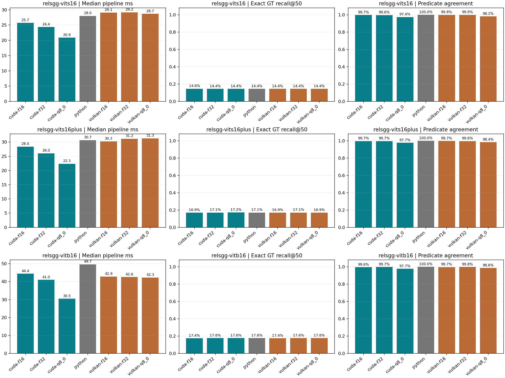
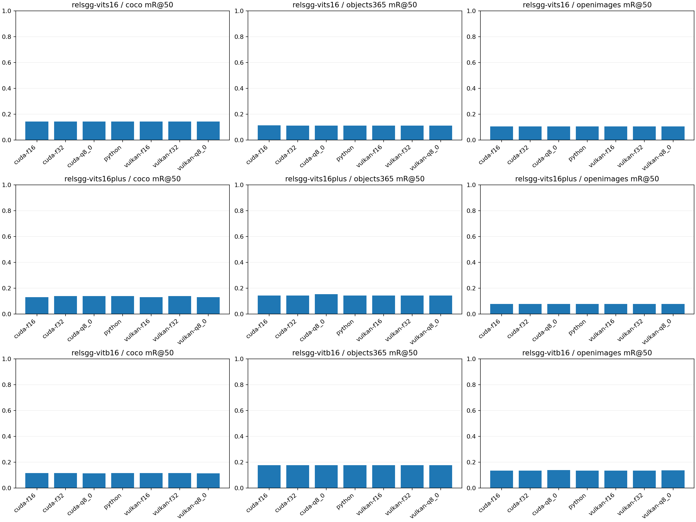

# Official full-graph PyTorch / GGML comparison

Generated 2026-09-30T14:04:54.063741+00:00. Hardware: Linux-5.15.0-139-generic-x86_64-with-glibc2.31.

All rows use the same 50 retained RA-4M images, GT boxes, 448 x 448 pixels, 19,103 predicates, and official checkpoints.
Python measures image decode through calibrated triplets with CUDA synchronization. GGML measures native C++ image decode, Pillow-compatible resize, normalization, full graph allocation/transfers/execution, and calibrated triplets in one wall-clock interval. Model loading and artifact writes are excluded for both. Numerical validation uses a separate raw-logit pass; exporting 9.8 MB per image does not burden the native deployment timing.
Accelerated attention uses F16 K/V with F32 accumulation for all storage types. Use --no-flash for explicit F32 attention. F32/F16/Q8 label weight storage, not every activation. For controlled runs, timing_attempts.json records sampled GPU processes and discarded attempts. Explicit --allow-gpu-pid values permit persistent services on both sides. Hardware/process snapshots are included in each results.json; measurements on this shared workstation are not isolated-device guarantees.
Raw logits are aligned by subject/object IDs. A changed pair set is reported separately. Quantized storage cannot be bit identical to F32. Exact-string R/mR are local diagnostics on incomplete positive annotations, not upstream OVS-F1 or negative-set AP.

| Model | Engine/storage | Median ms | P95 ms | R@50 | mR@50 | Logit RMSE | Top-1 agreement | Pair recall |
|---|---|---:|---:|---:|---:|---:|---:|---:|
| relsgg-vits16 | cuda/f16 | 25.69 | 27.72 | 14.57% | 11.38% | 0.00432 | 99.74% | 99.98% |
| relsgg-vits16 | cuda/f32 | 24.37 | 27.34 | 14.45% | 11.37% | 0.00267 | 99.64% | 100.00% |
| relsgg-vits16 | cuda/q8_0 | 20.87 | 22.79 | 14.45% | 11.37% | 0.04015 | 97.38% | 99.66% |
| relsgg-vits16 | pytorch-cuda/f32 | 28.01 | 30.26 | 14.45% | 11.37% | 0.00000 | 100.00% | 100.00% |
| relsgg-vits16 | vulkan/f16 | 29.07 | 32.03 | 14.45% | 11.37% | 0.00331 | 99.82% | 100.00% |
| relsgg-vits16 | vulkan/f32 | 29.17 | 32.08 | 14.45% | 11.37% | 0.00256 | 99.87% | 99.98% |
| relsgg-vits16 | vulkan/q8_0 | 28.66 | 31.96 | 14.45% | 11.37% | 0.02609 | 98.16% | 99.81% |
| relsgg-vits16plus | cuda/f16 | 28.39 | 30.47 | 16.94% | 10.47% | 0.00451 | 99.69% | 99.95% |
| relsgg-vits16plus | cuda/f32 | 26.02 | 27.95 | 17.06% | 10.96% | 0.00357 | 99.69% | 99.97% |
| relsgg-vits16plus | cuda/q8_0 | 22.35 | 24.30 | 17.19% | 11.43% | 0.03588 | 97.68% | 99.80% |
| relsgg-vits16plus | pytorch-cuda/f32 | 30.68 | 32.71 | 17.06% | 10.96% | 0.00000 | 100.00% | 100.00% |
| relsgg-vits16plus | vulkan/f16 | 30.25 | 33.91 | 16.94% | 10.47% | 0.00437 | 99.75% | 99.97% |
| relsgg-vits16plus | vulkan/f32 | 31.17 | 34.81 | 17.06% | 10.96% | 0.00332 | 99.61% | 99.98% |
| relsgg-vits16plus | vulkan/q8_0 | 31.30 | 34.78 | 16.94% | 10.47% | 0.02446 | 98.36% | 99.89% |
| relsgg-vitb16 | cuda/f16 | 44.41 | 47.47 | 17.43% | 12.98% | 0.00363 | 99.57% | 99.98% |
| relsgg-vitb16 | cuda/f32 | 41.02 | 43.23 | 17.56% | 13.00% | 0.00255 | 99.74% | 100.00% |
| relsgg-vitb16 | cuda/q8_0 | 30.50 | 32.71 | 17.56% | 12.88% | 0.03382 | 97.65% | 99.80% |
| relsgg-vitb16 | pytorch-cuda/f32 | 49.65 | 52.44 | 17.56% | 13.00% | 0.00000 | 100.00% | 100.00% |
| relsgg-vitb16 | vulkan/f16 | 42.85 | 45.43 | 17.43% | 12.98% | 0.00284 | 99.67% | 100.00% |
| relsgg-vitb16 | vulkan/f32 | 42.57 | 46.24 | 17.56% | 13.00% | 0.00227 | 99.79% | 99.98% |
| relsgg-vitb16 | vulkan/q8_0 | 42.28 | 44.82 | 17.56% | 12.87% | 0.01913 | 98.60% | 99.89% |

Memory fields use different allocator scopes: PyTorch peak allocated bytes versus GGML weight (including packed QKV) plus scheduler buffers. Neither includes every driver allocation; do not treat them as directly comparable process VRAM peaks.





[All metrics CSV](metrics.csv) includes R/mR at 20, 50 and 100, their harmonic F1, log-frequency weighted recall, and local support buckets. F1 follows upstream: harmonic R and mR, not precision/recall F1. [Source breakdown](source_breakdown.json) covers all three source corpora.

## Complete per-image comparisons

Each image below links to three complete grids. Every grid has ground truth, official PyTorch, and every measured backend/storage combination.

- 9282 (coco, hard): [relsgg-vits16](visualizations/relsgg-vits16/000_9282.png) | [relsgg-vits16plus](visualizations/relsgg-vits16plus/000_9282.png) | [relsgg-vitb16](visualizations/relsgg-vitb16/000_9282.png)
- 11355 (openimages, hard): [relsgg-vits16](visualizations/relsgg-vits16/001_11355.png) | [relsgg-vits16plus](visualizations/relsgg-vits16plus/001_11355.png) | [relsgg-vitb16](visualizations/relsgg-vitb16/001_11355.png)
- 14198 (objects365, hard): [relsgg-vits16](visualizations/relsgg-vits16/002_14198.png) | [relsgg-vits16plus](visualizations/relsgg-vits16plus/002_14198.png) | [relsgg-vitb16](visualizations/relsgg-vitb16/002_14198.png)
- 16127 (objects365, hard): [relsgg-vits16](visualizations/relsgg-vits16/003_16127.png) | [relsgg-vits16plus](visualizations/relsgg-vits16plus/003_16127.png) | [relsgg-vitb16](visualizations/relsgg-vitb16/003_16127.png)
- 19163 (objects365, moderate): [relsgg-vits16](visualizations/relsgg-vits16/004_19163.png) | [relsgg-vits16plus](visualizations/relsgg-vits16plus/004_19163.png) | [relsgg-vitb16](visualizations/relsgg-vitb16/004_19163.png)
- 24757 (coco, moderate): [relsgg-vits16](visualizations/relsgg-vits16/005_24757.png) | [relsgg-vits16plus](visualizations/relsgg-vits16plus/005_24757.png) | [relsgg-vitb16](visualizations/relsgg-vitb16/005_24757.png)
- 27190 (coco, hard): [relsgg-vits16](visualizations/relsgg-vits16/006_27190.png) | [relsgg-vits16plus](visualizations/relsgg-vits16plus/006_27190.png) | [relsgg-vitb16](visualizations/relsgg-vitb16/006_27190.png)
- 52536 (objects365, hard): [relsgg-vits16](visualizations/relsgg-vits16/007_52536.png) | [relsgg-vits16plus](visualizations/relsgg-vits16plus/007_52536.png) | [relsgg-vitb16](visualizations/relsgg-vitb16/007_52536.png)
- 55085 (coco, moderate): [relsgg-vits16](visualizations/relsgg-vits16/008_55085.png) | [relsgg-vits16plus](visualizations/relsgg-vits16plus/008_55085.png) | [relsgg-vitb16](visualizations/relsgg-vitb16/008_55085.png)
- 71069 (coco, hard): [relsgg-vits16](visualizations/relsgg-vits16/009_71069.png) | [relsgg-vits16plus](visualizations/relsgg-vits16plus/009_71069.png) | [relsgg-vitb16](visualizations/relsgg-vitb16/009_71069.png)
- 81185 (objects365, hard): [relsgg-vits16](visualizations/relsgg-vits16/010_81185.png) | [relsgg-vits16plus](visualizations/relsgg-vits16plus/010_81185.png) | [relsgg-vitb16](visualizations/relsgg-vitb16/010_81185.png)
- 91806 (openimages, moderate): [relsgg-vits16](visualizations/relsgg-vits16/011_91806.png) | [relsgg-vits16plus](visualizations/relsgg-vits16plus/011_91806.png) | [relsgg-vitb16](visualizations/relsgg-vitb16/011_91806.png)
- 92254 (coco, hard): [relsgg-vits16](visualizations/relsgg-vits16/012_92254.png) | [relsgg-vits16plus](visualizations/relsgg-vits16plus/012_92254.png) | [relsgg-vitb16](visualizations/relsgg-vitb16/012_92254.png)
- 97855 (objects365, hard): [relsgg-vits16](visualizations/relsgg-vits16/013_97855.png) | [relsgg-vits16plus](visualizations/relsgg-vits16plus/013_97855.png) | [relsgg-vitb16](visualizations/relsgg-vitb16/013_97855.png)
- 102063 (openimages, hard): [relsgg-vits16](visualizations/relsgg-vits16/014_102063.png) | [relsgg-vits16plus](visualizations/relsgg-vits16plus/014_102063.png) | [relsgg-vitb16](visualizations/relsgg-vitb16/014_102063.png)
- 104029 (objects365, hard): [relsgg-vits16](visualizations/relsgg-vits16/015_104029.png) | [relsgg-vits16plus](visualizations/relsgg-vits16plus/015_104029.png) | [relsgg-vitb16](visualizations/relsgg-vitb16/015_104029.png)
- 115571 (objects365, hard): [relsgg-vits16](visualizations/relsgg-vits16/016_115571.png) | [relsgg-vits16plus](visualizations/relsgg-vits16plus/016_115571.png) | [relsgg-vitb16](visualizations/relsgg-vitb16/016_115571.png)
- 122698 (objects365, moderate): [relsgg-vits16](visualizations/relsgg-vits16/017_122698.png) | [relsgg-vits16plus](visualizations/relsgg-vits16plus/017_122698.png) | [relsgg-vitb16](visualizations/relsgg-vitb16/017_122698.png)
- 129927 (openimages, moderate): [relsgg-vits16](visualizations/relsgg-vits16/018_129927.png) | [relsgg-vits16plus](visualizations/relsgg-vits16plus/018_129927.png) | [relsgg-vitb16](visualizations/relsgg-vitb16/018_129927.png)
- 134453 (openimages, moderate): [relsgg-vits16](visualizations/relsgg-vits16/019_134453.png) | [relsgg-vits16plus](visualizations/relsgg-vits16plus/019_134453.png) | [relsgg-vitb16](visualizations/relsgg-vitb16/019_134453.png)
- 143376 (openimages, hard): [relsgg-vits16](visualizations/relsgg-vits16/020_143376.png) | [relsgg-vits16plus](visualizations/relsgg-vits16plus/020_143376.png) | [relsgg-vitb16](visualizations/relsgg-vitb16/020_143376.png)
- 143697 (openimages, moderate): [relsgg-vits16](visualizations/relsgg-vits16/021_143697.png) | [relsgg-vits16plus](visualizations/relsgg-vits16plus/021_143697.png) | [relsgg-vitb16](visualizations/relsgg-vitb16/021_143697.png)
- 144846 (openimages, hard): [relsgg-vits16](visualizations/relsgg-vits16/022_144846.png) | [relsgg-vits16plus](visualizations/relsgg-vits16plus/022_144846.png) | [relsgg-vitb16](visualizations/relsgg-vitb16/022_144846.png)
- 147904 (openimages, hard): [relsgg-vits16](visualizations/relsgg-vits16/023_147904.png) | [relsgg-vits16plus](visualizations/relsgg-vits16plus/023_147904.png) | [relsgg-vitb16](visualizations/relsgg-vitb16/023_147904.png)
- 149460 (coco, hard): [relsgg-vits16](visualizations/relsgg-vits16/024_149460.png) | [relsgg-vits16plus](visualizations/relsgg-vits16plus/024_149460.png) | [relsgg-vitb16](visualizations/relsgg-vitb16/024_149460.png)
- 162793 (openimages, moderate): [relsgg-vits16](visualizations/relsgg-vits16/025_162793.png) | [relsgg-vits16plus](visualizations/relsgg-vits16plus/025_162793.png) | [relsgg-vitb16](visualizations/relsgg-vitb16/025_162793.png)
- 172835 (objects365, hard): [relsgg-vits16](visualizations/relsgg-vits16/026_172835.png) | [relsgg-vits16plus](visualizations/relsgg-vits16plus/026_172835.png) | [relsgg-vitb16](visualizations/relsgg-vitb16/026_172835.png)
- 198214 (coco, hard): [relsgg-vits16](visualizations/relsgg-vits16/027_198214.png) | [relsgg-vits16plus](visualizations/relsgg-vits16plus/027_198214.png) | [relsgg-vitb16](visualizations/relsgg-vitb16/027_198214.png)
- 228279 (openimages, hard): [relsgg-vits16](visualizations/relsgg-vits16/028_228279.png) | [relsgg-vits16plus](visualizations/relsgg-vits16plus/028_228279.png) | [relsgg-vitb16](visualizations/relsgg-vitb16/028_228279.png)
- 231594 (coco, hard): [relsgg-vits16](visualizations/relsgg-vits16/029_231594.png) | [relsgg-vits16plus](visualizations/relsgg-vits16plus/029_231594.png) | [relsgg-vitb16](visualizations/relsgg-vitb16/029_231594.png)
- 239442 (objects365, hard): [relsgg-vits16](visualizations/relsgg-vits16/030_239442.png) | [relsgg-vits16plus](visualizations/relsgg-vits16plus/030_239442.png) | [relsgg-vitb16](visualizations/relsgg-vitb16/030_239442.png)
- 245050 (objects365, hard): [relsgg-vits16](visualizations/relsgg-vits16/031_245050.png) | [relsgg-vits16plus](visualizations/relsgg-vits16plus/031_245050.png) | [relsgg-vitb16](visualizations/relsgg-vitb16/031_245050.png)
- 265747 (coco, hard): [relsgg-vits16](visualizations/relsgg-vits16/032_265747.png) | [relsgg-vits16plus](visualizations/relsgg-vits16plus/032_265747.png) | [relsgg-vitb16](visualizations/relsgg-vitb16/032_265747.png)
- 266825 (objects365, moderate): [relsgg-vits16](visualizations/relsgg-vits16/033_266825.png) | [relsgg-vits16plus](visualizations/relsgg-vits16plus/033_266825.png) | [relsgg-vitb16](visualizations/relsgg-vitb16/033_266825.png)
- 280716 (openimages, hard): [relsgg-vits16](visualizations/relsgg-vits16/034_280716.png) | [relsgg-vits16plus](visualizations/relsgg-vits16plus/034_280716.png) | [relsgg-vitb16](visualizations/relsgg-vitb16/034_280716.png)
- 300959 (openimages, hard): [relsgg-vits16](visualizations/relsgg-vits16/035_300959.png) | [relsgg-vits16plus](visualizations/relsgg-vits16plus/035_300959.png) | [relsgg-vitb16](visualizations/relsgg-vitb16/035_300959.png)
- 302113 (objects365, hard): [relsgg-vits16](visualizations/relsgg-vits16/036_302113.png) | [relsgg-vits16plus](visualizations/relsgg-vits16plus/036_302113.png) | [relsgg-vitb16](visualizations/relsgg-vitb16/036_302113.png)
- 323754 (coco, hard): [relsgg-vits16](visualizations/relsgg-vits16/037_323754.png) | [relsgg-vits16plus](visualizations/relsgg-vits16plus/037_323754.png) | [relsgg-vitb16](visualizations/relsgg-vitb16/037_323754.png)
- 358187 (objects365, hard): [relsgg-vits16](visualizations/relsgg-vits16/038_358187.png) | [relsgg-vits16plus](visualizations/relsgg-vits16plus/038_358187.png) | [relsgg-vitb16](visualizations/relsgg-vitb16/038_358187.png)
- 372522 (objects365, hard): [relsgg-vits16](visualizations/relsgg-vits16/039_372522.png) | [relsgg-vits16plus](visualizations/relsgg-vits16plus/039_372522.png) | [relsgg-vitb16](visualizations/relsgg-vitb16/039_372522.png)
- 392539 (openimages, hard): [relsgg-vits16](visualizations/relsgg-vits16/040_392539.png) | [relsgg-vits16plus](visualizations/relsgg-vits16plus/040_392539.png) | [relsgg-vitb16](visualizations/relsgg-vitb16/040_392539.png)
- 431358 (openimages, hard): [relsgg-vits16](visualizations/relsgg-vits16/041_431358.png) | [relsgg-vits16plus](visualizations/relsgg-vits16plus/041_431358.png) | [relsgg-vitb16](visualizations/relsgg-vitb16/041_431358.png)
- 433188 (coco, moderate): [relsgg-vits16](visualizations/relsgg-vits16/042_433188.png) | [relsgg-vits16plus](visualizations/relsgg-vits16plus/042_433188.png) | [relsgg-vitb16](visualizations/relsgg-vitb16/042_433188.png)
- 437629 (coco, hard): [relsgg-vits16](visualizations/relsgg-vits16/043_437629.png) | [relsgg-vits16plus](visualizations/relsgg-vits16plus/043_437629.png) | [relsgg-vitb16](visualizations/relsgg-vitb16/043_437629.png)
- 461572 (openimages, hard): [relsgg-vits16](visualizations/relsgg-vits16/044_461572.png) | [relsgg-vits16plus](visualizations/relsgg-vits16plus/044_461572.png) | [relsgg-vitb16](visualizations/relsgg-vitb16/044_461572.png)
- 465589 (coco, hard): [relsgg-vits16](visualizations/relsgg-vits16/045_465589.png) | [relsgg-vits16plus](visualizations/relsgg-vits16plus/045_465589.png) | [relsgg-vitb16](visualizations/relsgg-vitb16/045_465589.png)
- 471413 (objects365, hard): [relsgg-vits16](visualizations/relsgg-vits16/046_471413.png) | [relsgg-vits16plus](visualizations/relsgg-vits16plus/046_471413.png) | [relsgg-vitb16](visualizations/relsgg-vitb16/046_471413.png)
- 475063 (coco, hard): [relsgg-vits16](visualizations/relsgg-vits16/047_475063.png) | [relsgg-vits16plus](visualizations/relsgg-vits16plus/047_475063.png) | [relsgg-vitb16](visualizations/relsgg-vitb16/047_475063.png)
- 481986 (coco, moderate): [relsgg-vits16](visualizations/relsgg-vits16/048_481986.png) | [relsgg-vits16plus](visualizations/relsgg-vits16plus/048_481986.png) | [relsgg-vitb16](visualizations/relsgg-vitb16/048_481986.png)
- 495397 (coco, hard): [relsgg-vits16](visualizations/relsgg-vits16/049_495397.png) | [relsgg-vits16plus](visualizations/relsgg-vits16plus/049_495397.png) | [relsgg-vitb16](visualizations/relsgg-vitb16/049_495397.png)

### Full illustrated galleries

- [relsgg-vits16: all 50 grids embedded](GALLERY-relsgg-vits16.md)
- [relsgg-vits16plus: all 50 grids embedded](GALLERY-relsgg-vits16plus.md)
- [relsgg-vitb16: all 50 grids embedded](GALLERY-relsgg-vitb16.md)

## Reproduce

```sh
python cpp_ggml/scripts/benchmark_full_graph.py --stage all
```

Raw per-image outputs, predictions, timing samples and logit comparisons are stored beside this report. `summary.json` is the machine-readable source for the chart. No values from adapter fixtures enter this report.
